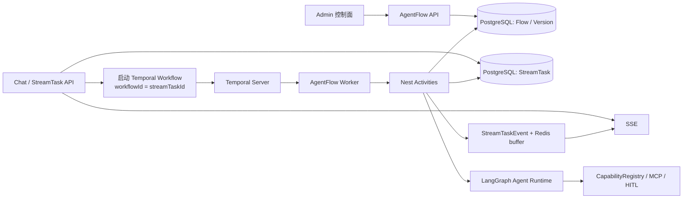

# AgentFlow 后端架构设计

> 状态：阶段 0-5 的控制面、Temporal Harness、`StreamTask` 事务事件投影和独立节点执行器已落代码。已发布 Flow 仅在 admin 测试会话中从 API 进程内 producer 切换到 Temporal；`agent`、`synthesize`、`plan`、`approval`、`plan-loop`、`condition` 的**代码路径已实现，但尚无真实链路验证**——单测中模型调用为 mock，唯一的集成用例走的是单 condition 节点、无后继边、不调用真实模型的最小 Flow，只覆盖基础设施接线；审批 Signal 通过 outbox，取消 Signal 通过数据库状态补偿派发。普通聊天、移动端消费和 HTTP/E2E 闭环仍留在阶段 5 后续工作，尚未灰度。
> 日期：2026-08-19。
> 范围：`apps/api` 的 AgentFlow 控制面与执行面；不包含 admin 画布实现。

## 1. 目标与边界

AgentFlow 是管理员配置、测试、发布并运行 AI 工作流的后端能力。一个已发布的 Flow 是不可变的 JSON 工件；一次用户任务锁定一个发布版本，并可在进程重启、人工审批、临时失败和 worker 切换后按同一版本继续。

本设计解决以下问题：

- 以 JSON 表达并导入、导出、校验 AgentFlow。
- 将当前 Direct、ReAct、PlanExecute、Hybrid 收敛为可见的预设 Flow。
- 将长任务的步骤推进、计时、重试、取消和人工等待交给 Temporal。
- 保留 LangGraph 对 Agent 节点的模型推理、工具循环、工具 HITL 和上下文编排能力。
- 保留 `StreamTask` 作为客户端任务事实源、SSE 回放源和会话 trace 归属。

以下内容不进入 V1：

- 任意 JavaScript、SQL、HTTP URL 或 prompt 模板表达式执行。
- 管理员直接配置未注册的工具、MCP server、模型密钥或审批豁免。
- 任意环状 DAG、并行扇出、子 Agent 编排和跨 Flow 调用。
- 将 Temporal Web UI 作为产品 admin 的替代品。

## 2. 现状与决策

当前链路为 `Chat -> StreamTask -> CommonChatAgentRunner -> AgentLoopRunner -> StrategyRegistry -> Graph`。`StreamTask` 已持久化任务、事件和 trace；`PlanGraphRunner` 已为 Plan/Hybrid 提供 LangGraph StateGraph 与 Postgres checkpoint；但实时执行仍由 API 进程内 producer 发起，进程在未完成模型调用期间退出时不能以语义步骤继续。

目标架构采用以下职责划分：

| 模块                 | 唯一职责                                   | 不承担的职责                    |
| -------------------- | ------------------------------------------ | ------------------------------- |
| `AgentFlow` 控制面   | 草稿、版本、发布、导入导出、结构校验       | 调模型、执行工具、管理 SSE 连接 |
| Temporal Workflow    | 节点顺序、等待、超时、重试、取消、恢复     | 直接访问数据库、LLM、MCP、Redis |
| Temporal Activity    | 调用有副作用的 Nest 应用能力               | 决定 Flow 的下一条边            |
| LangGraph            | 单个 Agent/PlanLoop 节点内的模型和工具推理 | 长时间业务等待、跨节点调度      |
| `StreamTask`         | 用户任务、SSE、事件、消息、trace 的事实源  | 决定工作流分支和调度 worker     |
| `CapabilityRegistry` | 工具、技能、审批策略的闭集                 | 接受管理员动态注册的可执行代码  |

Temporal 是长 Flow 的外层 Harness，LangGraph 是 Agent 节点的内层执行器。两者不能共同拥有同一层状态：Temporal 拥有 Flow 节点推进和等待状态；LangGraph 仅保存尚未完成的 Agent 工具循环 checkpoint。

## 3. 总体结构



### 3.1 Temporal 运行规则

- Temporal Workflow 输入只含 `streamTaskId`、`flowVersionId`、`flowDigest`、Activity 队列名和非敏感运行标识。
- Workflow 只能解释冻结的 Flow JSON、更新内部状态、等待 Signal、启动 Activity 和设置 Timer。
- Activity 通过 `streamTaskId` 从 PostgreSQL 读取会话、消息、模型配置和用户凭据；不把原始对话、支付地址、MCP 原始响应或密钥放进 Temporal History。
- `workflowId` 固定为 `StreamTask.id`。Temporal 的 `runId` 写入任务执行快照，便于运营定位，但不作为业务主键。
- Workflow 所有模型、工具和写数据库操作均通过 Activity 完成。Activity 是至少一次执行，外部写操作必须具备稳定幂等键。
- 审批 Signal 只传递稳定的 `approvalId`，不传递用户决定、编辑后的参数或上下文；恢复 Activity 按 `taskId + approvalId` 从 PostgreSQL 读取已持久化的决定。

### 3.2 人工审批

工具审批与计划审批的产品语义保持不变。当前审批事实已经由 PostgreSQL 中的 `StreamTask`、审批 trace 与 LangGraph checkpoint 持久化，Redis 仅暂存“已提交、尚未被 API 续跑路径消费”的决定。AgentFlow 接入后，Temporal Workflow 成为持久等待 Signal、Timer、取消与恢复调度的编排者；审批决定先落 PostgreSQL，再经 outbox 发送 Signal，Redis 不再承担恢复命令队列职责。

1. Agent Activity 命中 LangGraph interrupt 后，在同一数据库事务创建 `AgentFlowApproval(PENDING)`、`ConversationTurnTraceItem(APPROVAL, RUNNING)`、审批请求 `StreamTaskEvent`，并将 `StreamTask` 投影为 `WAITING_HUMAN`。`AgentFlowApproval.id` 即稳定的 `approvalId`；工具审批与计划审批使用不同 `traceKey`，但都关联同一 `approvalId`。一个工具 interrupt 可能同时包含多个 `actionRequests`，它们组成一个不可拆分的审批批次：一个 `approvalId`、一条 trace、一个统一决定；展示层只接收所有请求共同允许且可安全统一应用的决定。多工具批次固定为 `approve/reject`，因为单份 `editedArgs` 不能安全映射到多个工具参数；恢复时由既有 `buildHitlResponse` 将决定依次作用于整批请求。
2. 事务提交后才将请求事件写入 Redis SSE 缓冲；Activity 返回等待结果，Workflow 的确定性分支等待对应 `approvalId` 的 Signal 并设置 Timer。事务失败不得留下只有等待态、没有审批记录和 trace 的任务。
3. 审批 API 锁定 `AgentFlowApproval(PENDING)`，校验任务属主、审批类别与请求摘要中持久化的允许决定集合；在同一事务写入决定、`*.resolved` 事件、trace 收敛结果和唯一的 `AgentFlowSignalOutbox`。相同 `taskId + approvalId` 的同一决定返回既有结果，不同决定返回冲突，不能覆盖首次决定。该服务端校验不能只依赖审批卡片，必须拒绝客户端直接提交多工具批次不支持的 `edit`。
4. outbox 派发器重试发送只含 `approvalId` 的 Temporal Signal。Workflow 收到后启动恢复 Activity；Activity 从 `AgentFlowApproval` 读取决定，并用原 LangGraph checkpoint 和原能力快照执行 `Command({ resume })`。`StreamTask` 回到 `STREAMING` 只能由该恢复 Activity 的幂等状态转换完成。
5. Workflow 超时或取消时同样经 Activity 落库：超时自动拒绝并终止，取消或恢复异常将待处理审批和 trace 标记为 `ERROR`。用户主动 approve/reject/edit/replan/terminate 均是已处理的有效决定，审批 trace 标记为 `SUCCESS`，其后的任务结果另由任务 trace 表达。

审批状态由多层协作，而不是由单一运行时拥有：

- `ConversationTurnTraceItem`：审批节点的可见历史与审计事实，生命周期为 `RUNNING -> SUCCESS/ERROR`；刷新页面后仍可完整回显。
- `StreamTask`：用户任务状态投影，`WAITING_HUMAN` 表示任务尚未被恢复 Activity 接管。
- `StreamTaskEvent`：可回放的审批请求、决定与终态事件，是 SSE 事件事实源。
- `AgentFlowApproval`：待处理审批与其最终决定的业务事实源；它提供稳定 `approvalId`、并发控制和恢复 Activity 的决定输入。
- `AgentFlowSignalOutbox`：事务内写入的、只含命令标识的 Signal 派发表；负责在 API/worker 故障后继续通知 Temporal。
- Temporal Workflow：持久等待 Signal、Timer、取消、恢复调度与 worker 容灾，不替代前述数据库事实。

LangGraph PostgreSQL checkpoint 只保存 Agent 子图的恢复数据，不能单独表达审批业务事实。

## 4. Flow 工件与版本模型

### 4.1 领域对象

```txt
AgentFlow
  一个逻辑 Flow，拥有稳定 id、名称、描述和当前发布版本。

AgentFlowVersion
  一份不可变 FlowDefinition JSON；状态为 DRAFT、PUBLISHED 或 ARCHIVED。

Agent
  保留名称、头像、启停和业务身份；发布后由 defaultFlowVersionId 选择默认执行形态。

StreamTask
  一次用户可见任务；锁定 flowVersionId、flowDigest、Temporal workflowId/runId 和当前 nodeKey。

StreamTaskRun
  一次客户端可见执行片段；人工恢复或重新派发时创建新行，不覆盖旧片段。内部 Activity 重试通过 node attempt 记录，不机械新增 run。

AgentFlowApproval
  一次审批交互的业务事实；保存 task/run/trace 关联、审批类别、安全请求摘要、决定、状态与时间戳。id 即 approvalId。

AgentFlowSignalOutbox
  已提交但尚未确认发送的 Temporal Signal 命令；用于弥合数据库提交与外部 Signal 调用之间的故障窗口。
```

`AgentFlowVersion` 的 JSON 是运行时唯一事实源。发布后的版本不得修改；回滚通过把旧版本重新设为当前发布版本实现，不复制或原地修改旧 JSON。

### 4.2 数据库字段

阶段 2 已在 Prisma schema 中定义 `AgentFlow`、`AgentFlowVersion`、`AgentFlowApproval` 与 `AgentFlowAuditLog`。`AgentFlowVersion.definition` 使用 `Json`，`digest` 使用 SHA-256 十六进制字符串，`schemaVersion` 使用整数。`Agent` 新增可空 `defaultFlowVersionId`，且管理端只能绑定 `PUBLISHED` 版本。`StreamTask` 已预留可空 `flowVersionId`、`flowDigest`、`temporalWorkflowId`、`temporalRunId`；`currentStep` 继续保存当前 nodeKey。`AgentFlowApproval` 包含 `taskId`、`runId`、`traceItemId`、`nodeKey`、类别、安全请求摘要、决定、决定时间与操作者，并以 `status=PENDING` 条件更新保证一次审批只能决议一次。

`AgentFlowSignalOutbox` 已随阶段 5 写入 schema 和控制面 migration，用于可靠投递审批 Signal；取消 Signal 不复制业务正文，而是以 `StreamTask.status=CANCELED` 为事实源，由补偿派发器在成功通知 Temporal 后在 `executionState.agentFlow.cancelSignalDeliveredAt` 写入投递标记。

AgentFlow 任务的 `StreamTask.executionState.agentFlow` 保存运行期小型快照：节点幂等结果、待审批 ID、计划步骤、PlanLoop 步骤索引和安全观察摘要。它不保存完整 FlowDefinition、完整对话、审批决定正文或工具原始响应；遗留策略任务继续保留既有策略快照。

所有数据库变更只修改 `apps/api/prisma/schema.prisma`；迁移由开发者本地执行 Prisma 生成，禁止手写 `migration.sql`。

### 4.3 生命周期

```txt
Flow: DRAFT --publish--> PUBLISHED --archive--> ARCHIVED
                             ^
                             | rollback（切换 AgentFlow.publishedVersionId）

StreamTask: PENDING -> STREAMING -> WAITING_HUMAN -> STREAMING -> COMPLETED
                                  |                    |
                                  |                    +-> ERROR
                                  +-> CANCELED / ERROR

Temporal FlowRuntime: QUEUED -> RUNNING -> WAITING_HUMAN -> RUNNING -> COMPLETED
                                         |                 |
                                         |                 +-> RETRY_SCHEDULED -> QUEUED
                                         +-> CANCELED / ERROR
```

`PENDING`、`STREAMING`、`WAITING_HUMAN` 等既有面向客户端的状态在迁移期间保持；FlowRuntime 内部状态不直接暴露为前端枚举。完成 Temporal 接管后，`STREAMING` 表示任务已派发且未终止、未进入人工等待，不表示某个 worker 线程或 Activity 必然正在运行；`WAITING_HUMAN` 表示已持久化等待审批 Signal。

## 5. FlowDefinition JSON

### 5.1 规范

FlowDefinition 是可导入导出的标准 JSON，不能使用画布库的私有序列化格式。画布坐标、缩放、折叠状态放在可选 `layout` 字段，运行时和摘要计算忽略该字段。

```json
{
  "schemaVersion": 1,
  "kind": "agent-flow",
  "name": "研究并回复",
  "description": "先规划，再使用受限工具完成步骤并汇总",
  "policy": {
    "maxSteps": 5,
    "maxModelCalls": 8,
    "maxToolCalls": 12,
    "maxDurationSeconds": 900
  },
  "nodes": [
    {
      "id": "plan",
      "type": "plan",
      "config": { "maxSteps": 5 }
    },
    {
      "id": "review",
      "type": "approval",
      "config": { "kind": "plan-review" }
    },
    {
      "id": "execute",
      "type": "plan-loop",
      "config": {
        "executor": {
          "type": "agent",
          "modelPreset": "openai:gpt-5.5",
          "toolGroups": ["search", "weather"],
          "maxToolIterations": 4
        },
        "stopPolicy": "all-steps"
      }
    },
    {
      "id": "answer",
      "type": "synthesize",
      "config": {}
    }
  ],
  "edges": [
    { "from": "plan", "to": "review" },
    { "from": "review", "to": "execute", "when": "approved" },
    { "from": "execute", "to": "answer" }
  ],
  "layout": { "nodes": { "plan": { "x": 80, "y": 120 } } }
}
```

### 5.2 节点闭集

| 节点         | 输入与输出                      | V1 行为                                                    |
| ------------ | ------------------------------- | ---------------------------------------------------------- |
| `agent`      | 会话上下文 -> 文本或结构化结果  | 直答或受限 ReAct；模型、提示词、工具组和工具循环上限是配置 |
| `plan`       | 用户目标 -> `AgentPlan`         | 使用现有 `PlannerService`；失败降级为单步计划              |
| `plan-loop`  | `AgentPlan` -> observations     | 内部按计划逐步调用 Agent；自身是唯一允许的受控循环         |
| `approval`   | 计划草案 -> 计划审批决定        | V1 只支持 `plan-review`；决定枚举由后端固定                |
| `condition`  | 强类型节点结果 -> 单一分支      | 只支持字段、比较操作和值；不支持表达式字符串               |
| `synthesize` | observations + 会话 -> 最终文本 | 只做无工具模型汇总                                         |

`start` 与 `end` 是隐式节点，不写入 JSON。工具默认在 `agent` 或 `plan-loop.executor` 内由 ReAct 决定；工具 HITL 也在该节点内部产生，由 Temporal 等待其对应 `AgentFlowApproval`，并不画成可任意配置的 `approval` 节点。V1 不开放通用 `tool` 节点；未来只有具备输入 schema、幂等性声明和审批策略的确定性工具才能成为显式节点。

内置预设使用 `modelPreset='agent-default'` 表示“继承本任务锁定的 Agent 默认模型”，它不是供应商模型 ID，也不在 Definition 中固化部署环境的具体模型。阶段 1 的结构校验只校验其非空；阶段 3 的运行时闭集校验负责把它解析为任务快照中的模型预设，并拒绝不存在、禁用或无权限的显式模型预设。

### 5.3 校验规则

发布前必须同时通过结构校验和运行时校验：

- `schemaVersion` 必须等于已支持版本，未知版本拒绝导入。
- 节点 id 在单个 Definition 内唯一，且仅允许 `[a-z][a-z0-9_-]{0,63}`。
- 必须存在唯一入口和至少一个可达终点；除 `plan-loop` 的内部循环外，图不得有环。
- 每条 edge 的端点必须存在，`when` 必须属于源节点声明的结果枚举。
- `maxSteps`、模型调用数、工具调用数和时长不得超过服务端硬上限。
- `modelPreset`、工具组和 skill 必须存在于当前注册表闭集；用户级工具组的凭据可用性在任务创建时按锁定凭据校验，JSON 和发布者都无权绕过该要求。
- `requiresApproval` 只能由 `CapabilityRegistry` 计算；JSON 无权降低工具风险等级。
- 提示词长度、描述长度和 layout 大小受上限约束；导入 JSON 总大小受请求体上限约束。
- `layout` 不参与语义 digest；移除 `layout` 后以稳定键排序、标准 JSON 序列化，再计算 `digest`。

导入永远创建新的 DRAFT 版本。即使 digest 相同，也不复用或覆盖已有版本；管理员可明确选择将该草稿发布。

## 6. 预设 Flow

现有策略不是长期的运行时分叉，而是 V1 内置 FlowDefinition 模板：

| 名称         | 图形                                                                  | 等价的现有行为         |
| ------------ | --------------------------------------------------------------------- | ---------------------- |
| Direct       | `agent(tools=[])`                                                     | `DirectAnswerGraph`    |
| ReAct        | `agent(toolGroups=...)`                                               | `CommonReactGraph`     |
| Plan Execute | `plan -> approval(plan-review) -> plan-loop(all-steps) -> synthesize` | `PlanExecuteGraph`     |
| Hybrid       | `plan -> plan-loop(evaluate-after-step) -> synthesize`                | `HybridPlanReactGraph` |

`PlanGraphRunner` 不再以策略名作为核心接口。它演进为 `PlanLoopExecutor`：输入为 `PlanLoopPolicy`，其中 `stopPolicy` 为 `all-steps` 或 `evaluate-after-step`，`planReview` 为 `required` 或 `disabled`。Plan 与 Hybrid 继续复用一套节点状态和同一条恢复链路，不能复制两套图。

迁移完成后，`AgentStrategyMode` 和 `StrategyRegistryService` 不再决定已发布 AgentFlow 的执行。旧任务只按锁定的旧策略恢复，直到完成或过期；不为新任务长期保留双写或双执行兼容层。

## 7. Temporal Workflow 与 Activity

### 7.1 Workflow 伪代码

```ts
// 该文件只能依赖 Temporal Workflow API 与纯类型；不能注入 Nest 服务。
async function agentFlowWorkflow(input: FlowRunInput) {
  const snapshot = await activities.loadRunSnapshot(input.streamTaskId);
  let state = { nodeKey: snapshot.entryNodeKey, outputs: {} };

  while (state.nodeKey) {
    const node = snapshot.definition.nodesById[state.nodeKey];
    const result = await activities.executeNode({ ...input, state, node });

    if (result.kind === 'waiting_human') {
      const decision = await waitForApprovalSignal(result.approvalId);
      state = await activities.resumeNode({ ...input, state, node, decision });
      continue;
    }

    state = selectNextState(snapshot.definition, state, result);
  }

  await activities.completeTask({ streamTaskId: input.streamTaskId, state });
}
```

`selectNextState` 是纯函数，只读取冻结 Definition、节点结果枚举与确定性 condition；不得访问数据库或当前 admin 草稿。超时、取消和重试由 Workflow 的 Timer、Cancellation Scope 和 Activity Retry Policy 管理。

当前实现不会把完整 `FlowDefinition` 传入 Temporal History：`loadRunSnapshot` 只返回入口 nodeKey、总时长、节点类型及受限 `next` 映射。审批 Signal 只传 `approvalId`，Workflow 可在同一节点连续等待多个 approvalId，并在恢复后再次进入等待；审批决定正文始终由阶段 5 的 Activity 从 PostgreSQL 读取。

### 7.2 Activity 分类

| Activity                                        | 副作用                                | 幂等要求                                                                                                 |
| ----------------------------------------------- | ------------------------------------- | -------------------------------------------------------------------------------------------------------- |
| `loadRunSnapshot`                               | 读任务、FlowVersion、会话、模型配置   | 只读                                                                                                     |
| `markNodeStarted` / `markNodeDone`              | 写任务、trace、SSE 事件               | 以 `taskId + nodeExecutionId + eventKind` 去重                                                           |
| `executeAgent`                                  | LLM 与 LangGraph 调用                 | 失败可重试；输出落库后才推进节点                                                                         |
| `executePlanLoop`                               | 多步 Agent 调用与 Agent checkpoint    | 用 checkpointThreadId 恢复；外部写工具仍单独幂等                                                         |
| `executeAgent` / `executePlanLoop` 内的工具调用 | LangGraph 工具循环中的 MCP/第三方动作 | 工具接收稳定 `idempotencyKey = taskId:flowVersionId:nodeExecutionId`；V1 不拆独立 `executeTool` Activity |
| `finalizeTask`                                  | 写最终消息、任务状态和终态事件        | 事务性去重                                                                                               |

Activity 返回值仅保留节点结果枚举、摘要、数据库引用和已脱敏指标。大文本、模型原始响应、工具原始响应持久化在应用数据库；Temporal History 不保存它们。

`AgentFlowActivities` 通过 `loadRunSnapshot` 校验 `StreamTask.flowVersionId`、`flowDigest` 与不可变 `AgentFlowVersion` 后投影最小图结构。`executeNode`/`resumeNode` 会事务性投影 `flow.run.*`、`flow.node.*`、`flow.waiting_human`，并在事务提交后才追加 Redis SSE 帧；`finalizeRun` 会收敛任务、消息、run、待处理审批和审批 trace。PlanLoop 每步同步 checkpoint，恢复时不重跑已完成步骤。

### 7.3 Temporal Task Queue

V1 使用两个队列：

- `agent-flow-orchestrator`：由只注册 Workflow 的 worker 进程组轮询，不执行 LLM 或工具。
- `agent-flow-activity`：由只注册 Activity 的 worker 进程组轮询，运行数据库、LLM、MCP、SSE 写入等 Activity。

重工具和外部订单可在后续增加专用 Activity queue；这不是 V1 前置条件。Worker 以独立进程部署，不能随 Nest HTTP 进程启动而混跑。

Worker 与实际调度使用以下配置：`TEMPORAL_ADDRESS`、`TEMPORAL_NAMESPACE`、`TEMPORAL_TASK_QUEUE` 为必填；`TEMPORAL_ORCHESTRATOR_TASK_QUEUE`、`TEMPORAL_ACTIVITY_TASK_QUEUE` 可覆盖由基础队列推导的 `-orchestrator` 与 `-activity` 名称；`TEMPORAL_API_KEY` 与 `TEMPORAL_TLS` 用于 Cloud 或私有部署连接。`TemporalClientService` 启动 Workflow 时将已解析的 Activity 队列名写入最小 Workflow 输入，因此 Activity 代理始终投递到独立业务队列，而不采用 SDK 的“当前编排队列”默认值。HTTP API 只将这些字段作为可选环境变量登记；独立 Worker 或 `TemporalClientService` 在实际连接时缺失任一必填项都会失败，不会退化为内存 Workflow。部署入口为 `pnpm --filter ./apps/api run start:temporal-worker`，并必须显式设置 `TEMPORAL_WORKER_ROLE=orchestrator` 或 `activity`。

## 8. API 与协议

### 8.1 控制面 API

所有端点要求 `ADMIN` 角色：

| 方法   | 路径                                             | 语义                                   |
| ------ | ------------------------------------------------ | -------------------------------------- |
| `POST` | `/admin/agent-flows`                             | 创建 Flow 与首个 DRAFT 版本            |
| `GET`  | `/admin/agent-flows`                             | 列表，含当前发布版本摘要               |
| `GET`  | `/admin/agent-flows/:flowId`                     | Flow 与版本列表                        |
| `PUT`  | `/admin/agent-flow-versions/:versionId`          | 仅修改 DRAFT JSON                      |
| `POST` | `/admin/agent-flow-versions/:versionId/validate` | 返回 Definition 结构校验与语义 digest  |
| `POST` | `/admin/agent-flow-versions/:versionId/publish`  | 校验后原子发布                         |
| `POST` | `/admin/agent-flows/:flowId/import`              | 导入 JSON 为新 DRAFT                   |
| `GET`  | `/admin/agent-flow-versions/:versionId/export`   | 导出 Definition JSON，不含数据库元数据 |
| `POST` | `/admin/agent-flows/:flowId/rollback`            | 切换到历史 PUBLISHED/ARCHIVED 版本     |

当前所有表中端点已使用 `JwtAuthGuard`、`RolesGuard` 与 `@Roles('ADMIN')`。发布、导入、草稿编辑和回滚均使用可串行化事务，保证同一 Flow 同时只有一个 `publishedVersionId`；相应操作写入不含 JSON 正文的最小审计记录。`POST /admin/agent-flow-versions/:versionId/test` 依赖阶段 3 的运行时编译与阶段 5 的任务派发，当前未注册。`validate` 当前只做纯结构校验，工具组、技能和模型预设闭集校验在阶段 3 的 `FlowRuntimeValidator` 接入。

### 8.2 SSE 协议

现有 `strategy.selected` 和 `workflow.step.*` 不足以表达版本化 Flow：它们依赖 `AgentStrategyMode`，不能成为 Flow 的长期语义。新增事件需在 `packages/types/src/protocol` 定义，最小集合为：

```txt
flow.run.started       { flowId, flowVersionId, digest }
flow.node.started      { nodeKey, nodeType, title, traceKey }
flow.node.completed    { nodeKey, nodeType, traceKey, summary, durationMs }
flow.node.failed       { nodeKey, nodeType, traceKey, category, retryable }
flow.waiting_human     { approvalId, nodeKey, traceKey, approval, expiresAt }
flow.run.resumed       { runSequence, reason }
```

`approval` 是可判别的安全展示载荷：工具审批包含 `kind='tool'`、同一中断批次的全部工具名、脱敏参数、说明和共同允许决定；计划审批包含 `kind='plan-review'`、步骤、revision 和允许决定。它必须足以复用现有审批卡片，不能只发送节点名后让端侧猜测审批内容。

旧 `workflow.step.*` 在旧策略任务完成前保留，新的 Flow 任务只发送 `flow.*`。`ConversationTraceMapper` 以 `taskId`、`nodeKey`、`traceKey` 写入 trace，FlowVersion 通过 `StreamTask.flowVersionId` 关联查询；禁止用事件文案或策略名推断节点类型。

移动端和 admin 测试台必须先消费共享协议中的 `flow.*` 事件，再将 Flow dispatch 对普通聊天入口灰度。后端不能为了绕过端侧改造而把 Flow 节点伪装为旧策略字段，也不应长期双发两套执行语义。

## 9. 安全、可靠性与成本

### 9.1 副作用与幂等

Temporal Activity 是至少一次执行。所有写操作工具必须声明 `readOnly`、`idempotent` 或 `externalSideEffect`：

- `readOnly` 可按重试策略自动重试。
- `idempotent` 必须接收稳定幂等键后自动重试。
- `externalSideEffect` 若上游不支持幂等键，worker 丢失后进入 `UNKNOWN`，仅管理员核对后才能继续，不能静默重试。

### 9.2 超时与预算

FlowPolicy 的限制与服务端硬上限取最小值。执行器分别限制单 Activity 超时、节点重试次数、总 Duration、模型调用数、工具调用数和 token 使用。预算耗尽产生明确 `ERROR` 事件与结构化错误，不能收敛为空回复或伪成功。

### 9.3 数据与日志

- Temporal 输入、Signal 和 Activity 结果只传 ID、摘要和脱敏指标。
- 原始支付 URL、MCP token、模型密钥、用户上传凭据不得写入 Flow JSON、Temporal History、SSE 或 trace。
- 管理员导出 JSON 时不导出任务运行数据、Flow 审计数据或模型密钥。
- Flow 发布前检查 prompt/description 长度，运行时记录模型与工具的安全摘要，不记录原始密文。

## 10. 模块与代码归属

```txt
apps/api/src/
  modules/agent-flow/
    agent-flow.module.ts                 # 控制面模块，导出版本解析与调度入口
    definition/                          # Definition schema、JSON 解析、digest、校验
    version/                             # Flow / Version CRUD、发布、导入导出、审计
    runtime/                             # FlowRuntime、预设模板、节点执行编排与审批事实
    temporal/                            # Activity 实现、Temporal client、Signal 适配
  temporal/
    workflows/agent-flow.workflow.ts     # 纯 Temporal Workflow，无 Nest DI
    worker.ts                             # 独立 worker 启动入口
  modules/ai/
    agents/common-chat-agent/            # 保留单 Agent LangGraph 执行
    agent-loop/execution/plan-graph/      # PlanLoopExecutor 与状态/Builder/Runner
  modules/stream-task/
    ...                                  # 用户任务、SSE、事件、任务状态投影
```

`modules/agent-flow` 可以依赖 `AiModule` 以调用已封闭的 Agent Runtime；`AiModule` 不反向依赖 `AgentFlowModule`。`StreamTaskModule` 调用 `AgentFlowRuntime` 启动 Flow，避免 `AgentFlow` 依赖 `StreamTaskService` 形成循环。Temporal Workflow 文件不依赖 Nest module，Activity 通过 worker 启动时创建的 Nest application context 注入服务。

## 11. 验收标准

以下全部满足后，才将某个 Agent 切换到发布 Flow：

- Flow JSON 的导出、导入、校验和发布在相同 digest 上可复现。
- 无效节点、未知工具组、越权 MCP 组、循环边和超预算配置被明确拒绝。
- Direct、ReAct、PlanExecute、Hybrid 预设在回归样例中与当前用户可见语义一致。
- worker 在计划审批、工具审批、步骤间和模型失败后重启时，任务能按锁定版本恢复或给出明确错误。
- 具副作用工具在 Activity 重试、worker 崩溃和审批恢复下不产生重复业务事实。
- SSE 断线可按 Redis Stream ID（`Last-Event-ID`/`cursor`）回放；数据库语义 `StreamTask.lastEventId` 保持独立，新 `flow.*` 事件和 trace 归属一致。
- admin 草稿测试不影响生产 Flow、真实观测统计或用户会话。
